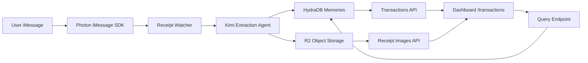

# Snap Tax

**Snap Tax is a web app that turns receipt photos you send in iMessage into a searchable expense ledger.** You sign in on the dashboard, forward or send receipts to a dedicated number, and each image is read by AI, stored, and shown as a transaction with totals, line items, and charts. You can also ask plain-language questions about your spending (for example totals over a time range), scoped to the receipts the app has saved.

No manual data entry for each line: the pipeline is built to run end-to-end from the message thread to persisted records and the UI.

## How it works (simple)

1. You authenticate on the web app (phone verification).
2. Receipt images arrive in a configured iMessage thread (via Photon on macOS).
3. An AI model (Kimi) extracts structured fields: merchant, dates, amounts, tax, tip, payment method, line items, and related metadata.
4. Each receipt is saved to HydraDB and the image file is stored in Cloudflare R2 (including HEIC handling where needed).
5. The **Transactions** dashboard lists everything, shows analytics (totals, categories, trends), and offers guardrailed Q&A over your saved data.

For developers and demos: the main receipt path is implemented in this repo—not a UI-only mock.

## Why it exists

Tax prep and expense tracking often fail because capturing receipts is slow and easy to skip. Snap Tax is aimed at people who already text photos of receipts: it turns that habit into an ongoing ledger instead of a year-end scramble.

## What works in this codebase (March 2026)

- Authenticated web app: `/login` → `/transactions`
- Automatic receipt watcher for a configured iMessage thread
- Manual **re-process latest receipt** from the dashboard
- Normalized extraction into merchant, dates, totals, tax, tip, payment method, line items
- HydraDB-backed storage and retrieval; R2 for receipt images
- Dashboard analytics (totals, tax, category breakdown, trends)
- Guardrailed natural-language Q&A for receipt/spend questions (`POST /api/imessage/reply`)

## Demo flow (about 2–3 minutes)

1. Start the app and sign in with a phone number in E.164 format.
2. Send a receipt image to the configured receipt number.
3. Watch processing status and a new row appear on `/transactions`.
4. Open a transaction to see parsed fields and line items.
5. Ask a spend question in the UI (for example: “How much did I spend last week?”).
6. Confirm the answer is grounded in stored HydraDB data.

Use **Re-process receipt** if you need to force the latest unprocessed image through again.

## Architecture



## Key routes

App pages:

- `/login` — phone verification sign-in
- `/transactions` — receipts, analytics, and Q&A

Core APIs:

- `POST /api/imessage/analyze-image` — process latest (or specified) receipt image
- `GET /api/transactions` — transactions from HydraDB
- `GET /api/receipt-images` — receipt image metadata
- `GET /api/receipt-images/preview?key=...&mimeType=...` — preview/redirect (HEIC supported)
- `POST /api/imessage/reply` — guardrailed receipt-domain Q&A via HydraDB
- `GET /api/processing-status` — active processing status

Auth APIs:

- `POST /api/auth/request-code`
- `POST /api/auth/verify-code`
- `GET /api/auth/session`
- `POST /api/auth/logout`

Standalone extraction API:

- `POST /api/kimi/extract-image` — direct image → structured JSON extraction

## Tech stack

- Next.js 16 (App Router)
- React 19
- TypeScript
- Photon iMessage SDK (`@photon-ai/imessage-kit`)
- Kimi via LangChain `ChatOpenAI` interface
- HydraDB for transaction memory and recall
- Cloudflare R2 (S3-compatible API) for receipt images

## Local setup

### 1. Install and run

```bash
npm install
npm run dev
```

Open `http://localhost:3000`.

### 2. Required environment variables

Minimum for the full demo path:

- `HYDRADB_API_KEY`
- `GMI_API_KEY` or `KIMI_API_KEY`
- `R2_BUCKET_URL`
- `S3_API_URL`
- `R2_ACCESS_KEY_ID`
- `R2_SECRET_ACCESS_KEY`

Optional:

- `HYDRADB_TENANT_ID` (defaults to `snap-tax`)
- `HYDRADB_SUB_TENANT_ID`
- `KIMI_BASE_URL`, `KIMI_MODEL`
- `R2_REGION` (defaults to `auto`)

### 3. iMessage runtime notes

- Intended to run on **macOS** with iMessage access for Photon.
- The watcher starts at app startup (instrumentation) and is reinforced on authenticated session checks.
- Auto-processing uses the signed-in user's verified phone number (session-scoped).

## Data model (persisted)

Each processed receipt is stored in HydraDB as a `snap_tax_receipt_v1` record with:

- Message identifiers (`messageGuid`, `chatId`)
- Summary text
- Normalized receipt extraction payload
- Processing timestamp (`processedAt`)
- Optional uploaded image metadata (`key`, `url`, MIME type, size)

The UI derives transaction views from these records.

## Guardrails and scope

The natural-language reply path rejects out-of-scope or risky prompts:

- Only receipt/expense-domain questions are accepted
- Obvious prompt-injection and SQL-like patterns are blocked
- Routing separates image extraction from text reply paths

## Known limitations

- Session and verification state are in-memory (lost on server restart).
- Auth is demo-oriented: the verification code may be returned in the API response.
- No multi-user tenant isolation beyond current tenant/sub-tenant configuration.
- No background job queue; processing is request- and watcher-driven.

## Testing

```bash
npm test
```

Tests focus on intake routing and guardrail behavior.

## Hackathon framing

Snap Tax is a concrete **agentic workflow over personal data**: multimodal intake (iMessage image) → structured extraction (LLM) → durable memory (HydraDB) → retrieval and answers (Q&A) → visible closure (dashboard and messaging). The differentiator is an operational pipeline in one flow, not a prototype UI alone.
