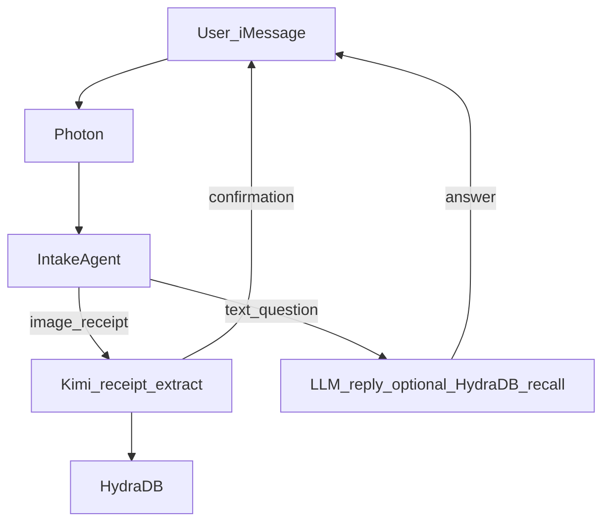

# Snap Tax

**Snap Tax** is a [Next.js](https://nextjs.org) app for logging receipts that arrive over **iMessage**: images are interpreted with **Kimi 2.5**, stored for the user, and surfaced in the UI. This repo is an MVP focused on the receipt path; routing, persistence, and a full transaction list are still being wired up (see [What's in the repo today](#whats-in-the-repo-today)).

## What we're building

- Users send **receipt images over iMessage**.
- **Photon** ([`@photon-ai/imessage-kit`](https://www.npmjs.com/package/@photon-ai/imessage-kit) for chat and attachments, [`@photon-ai/flux`](https://www.npmjs.com/package/@photon-ai/flux) for phone verification) lets the app talk to iMessage on the Mac side.
- Images go to **Kimi 2.5** for **structured receipt extraction** (summary, extracted text, and key-value fields—see [`src/lib/kimi-agent.ts`](src/lib/kimi-agent.ts)).
- **Goal:** log each extraction for the user and **show every processed transaction** on the frontend.
- **MVP data plan:** persist **transaction records** in **HydraDB** using the official setup flow ([HydraDB Quickstart](https://docs.hydradb.com/quickstart)): API base `https://api.hydradb.com`, `Authorization: Bearer <api_key>`, tenant creation, then ingestion or user-memory APIs as we choose for searchable context.
- **Dates:** each stored transaction should include **receipt or purchase date** when extraction provides it, plus a **processed / logged timestamp**, so the UI and future queries can filter by time (e.g. “last week”).
- **Confirmation:** after a receipt is processed and logged, the app **texts the user back on iMessage** (same thread) so they know it was logged. Today this aligns with optional `reply` on the analyze-image API; copy can tighten once HydraDB writes are in place.
- **Intake agent (routing):** incoming messages should eventually hit a single **intake agent** that picks the path: **(1) receipt extraction** (attachment → Kimi extract → HydraDB → confirmation) or **(2) LLM reply** (plaintext questions → model answer, optionally grounded with **HydraDB recall / Q&A** for spend questions). That avoids a separate ad hoc entry point per message type.
- **Future (after MVP):** fully wire the **LLM reply** path for **plaintext** prompts (e.g. “How much did I spend last week?”). The **receipt** path remains the primary MVP focus.

## Architecture (high level)



## HydraDB (planned)

Transaction context will live in **HydraDB** so we can **recall** it for agents and (later) natural-language questions. Follow [HydraDB Quickstart](https://docs.hydradb.com/quickstart) for API key, tenant, and ingestion. When integration lands, this app will use env vars such as `HYDRADB_API_KEY` and a tenant identifier—see `.env` or `.env.example` once those are added.

## What's in the repo today

**HydraDB**, **dated transaction persistence**, **a unified intake router**, and a **full transaction list UI** are **targets**, not fully implemented yet. The app currently exposes **receipt analysis** through explicit APIs/UI (e.g. analyze latest image) rather than automatic per-message routing. **Outbound confirmation** via iMessage is available when using analyze-image with `reply` enabled. **Plaintext spend questions** and **HydraDB-backed recall** for the LLM path are **planned**.

## API: Kimi image extraction

The app includes a Kimi-powered image extraction endpoint:

- `POST /api/kimi/extract-image`
- Request body:
  - `imageData`: required, either raw base64 or full data URL (`data:image/png;base64,...`)
  - `mimeType`: optional when `imageData` is raw base64
  - `prompt`: optional extraction context
  - `model`: optional model override
- Response body:
  - `extraction.summary`
  - `extraction.extractedText`
  - `extraction.fields` (key-value map)

Required env vars:

- `KIMI_API_KEY` (or fallback `GMI_API_KEY`)
- Optional: `KIMI_BASE_URL`, `KIMI_MODEL` (default: `kimi-k2-5`)

Example:

```bash
curl -X POST http://localhost:3000/api/kimi/extract-image \
  -H "Content-Type: application/json" \
  -d '{
    "imageData": "data:image/png;base64,<your-base64>",
    "prompt": "Extract line items and totals"
  }'
```

## Getting started

```bash
npm run dev
```

Open [http://localhost:3000](http://localhost:3000). The home UI lives in [`src/app/page.tsx`](src/app/page.tsx).

## Learn more

[Next.js documentation](https://nextjs.org/docs) · [Deploy on Vercel](https://vercel.com/new)
